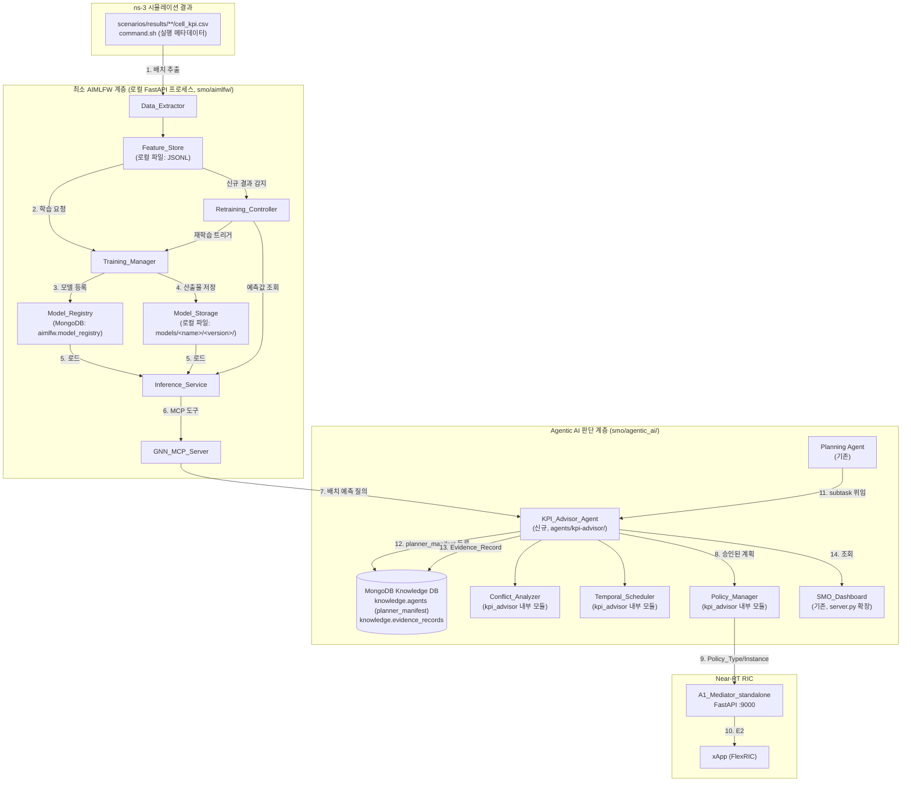
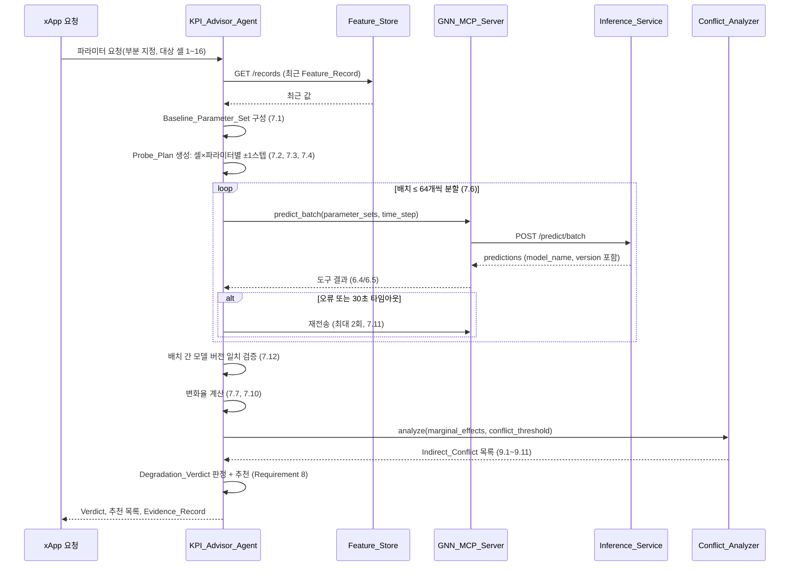
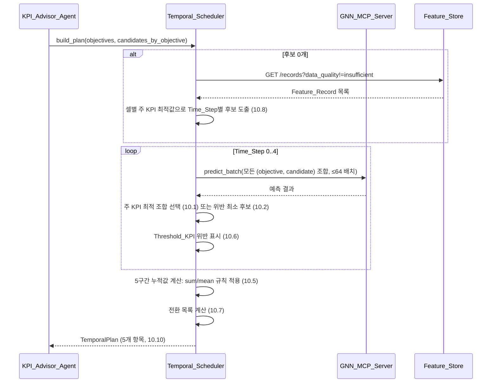
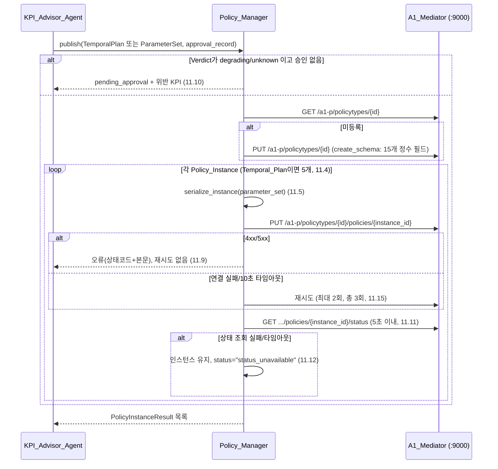
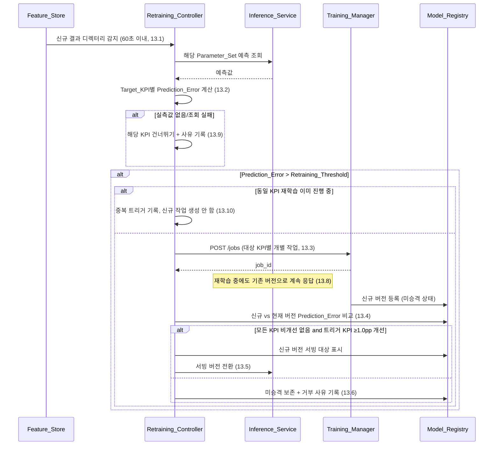

# Design Document

## Overview

본 설계는 `smo/` 하위에서 동작하는 **SMO Agentic AI Framework**를 세 계층으로 구현한다.

1. **최소 AIMLFW 계층**: `ns-3(LENA-oran-flexric)` 시뮬레이션 결과 `cell_kpi.csv`를 3분(180초) 간격 `Feature_Record`로 집계하고, GNN 모델을 학습·등록·배치 추론하며, 예측 정확도 저하 시 재학습을 트리거한다. Kubernetes/Kubeflow/KServe/InfluxDB/Cassandra 등 AIMLFW 참조 스택은 도입하지 않고, `Data_Extractor / Feature_Store / Training_Manager / Model_Registry / Model_Storage / Inference_Service` 6개 구성요소를 로컬 프로세스로 실행되는 경량 Python(FastAPI) 서비스로 구현한다. 모든 영속 데이터는 로컬 파일 시스템(JSON Lines/파일) 또는 기존 MongoDB(Knowledge DB와 동일 인스턴스, 별도 데이터베이스)에 저장한다.
2. **Agentic AI 판단 계층**: 기존 `smo/agentic_ai`(deep-agents 기반 Decomposition / Planning / Probe / Monitoring / Representative 에이전트, MongoDB Knowledge DB, Dashboard) 구조를 그대로 유지하고, 그 위에 신규 sub-agent인 `KPI_Advisor_Agent`를 `smo/agentic_ai/agents/kpi-advisor/`에 기존 에이전트와 동일한 5파일 구성(`agent.md`, `agent.py`, `schemas.py`, `server.py`, `pyproject.toml`)으로 추가한다. `Conflict_Analyzer`, `Temporal_Scheduler`, `Policy_Manager`는 `KPI_Advisor_Agent`가 임포트하는 라이브러리 모듈(`kpi_advisor/` 내부 패키지)로 구현하며, 새로운 오케스트레이션 계층이나 별도 런타임을 추가하지 않는다.
3. **A1 인터페이스 연동**: `Policy_Manager`가 기존 `A1_Mediator_standalone`(FastAPI, 포트 9000, 실제 코드 확인 결과 8개 Policy_Type/Policy_Instance 엔드포인트 + 1개 healthcheck 제공)의 정책 발행 경로만을 통해 판단 결과를 Near-RT RIC(FlexRIC) xApp에 전달한다.

Non-RT RIC은 SMO 내부에 위치하며, RAN 제어 권한은 Near-RT RIC/xApp(E2)에 남는다. 본 프레임워크는 정책(A1)과 AI 능력(AIMLFW)만 제공하고 RAN을 직접 제어하지 않는다.

### 실제 저장소 구조에 근거한 핵심 설계 결정

설계 과정에서 저장소를 직접 조사하여 다음 사실을 확인했고, 이는 설계 전반의 전제가 된다.

- **`cell_kpi.csv` 실제 스키마**: 헤더는 `time_s,interval_s,cell_id,cell,band,frequency_hz,bandwidth_hz,cio_bias_db,tx_power_dbm,rf_tx_power_w,ret_tilt_deg,ret_bearing_deg,ttt_ms,hysteresis_db,energy_state,num_ues,...`로 시작하며, 이후 rsrp/sinr/goodput/prb/delay/ho/energy 계열 KPI 열이 이어진다. 대상 셀은 정확히 3개: `gNB_5G`, `gNB_4G_1`, `gNB_4G_2`이며, CSV의 `cell` 열이 Glossary가 말하는 `cell_id`(문자열 식별자)에 대응한다. CSV에는 별도 정수형 `cell_id` 열(1/2/3, ns-3 내부 인덱스)도 존재하지만 이는 Feature_Record의 `cell_id` 키로 사용하지 않는다(내부 인덱스와 외부 식별자를 혼동하면 Requirement 1.1의 "정확히 1개의 Feature_Record" 불변식이 깨지므로 명시적으로 분리한다).
- **5개 Control_Parameter는 셀별 값이다**: `cio_bias_db, tx_power_dbm, ret_tilt_deg, hysteresis_db, ttt_ms` 5개 열이 각 CSV 행(= 각 cell, 각 시각)에 이미 존재한다. `command.sh`의 CLI 인자(`--cellTxPowerDbm=gNB_5G:43,gNB_4G_1:43,gNB_4G_2:43` 형태의 `cell:value` 맵)가 실행 메타데이터의 원천이며, 셀마다 다른 값을 가질 수 있다(예: `RET_HYS_grid_test`는 셀별 RET 값이 다름). 따라서 `Parameter_Set`은 "5개 스칼라 값의 집합"이 아니라 **"대상 셀 집합 × 5개 Control_Parameter" 2차원 값의 집합**으로 모델링한다. 이는 Requirement 7.1~7.3, 11.1~11.5의 "각 대상 셀의 5개 Control_Parameter 값"이라는 문구와 정확히 일치한다.
- **실행 메타데이터 원천**: `Data_Extractor`는 결과 디렉터리의 `command.sh`를 파싱하여 각 `--cellXxx=` 맵 인자에서 셀별 Control_Parameter 값을 추출하고, 파일 경로에 포함된 `seedNN` 패턴(예: `ue_positions_seed12.csv`, `seed12_...` 디렉터리명)에서 seed 값을 추출한다. CSV 행에도 동일 값이 매 인터벌마다 반복 기록되어 있으므로, `command.sh` 파싱이 실패하면 CSV의 해당 열 값(집계 구간 내 최빈값)으로 폴백한다. 이 폴백 규칙은 Requirement 1.5의 "실행 메타데이터에 기록된 값"이라는 요구를 다중 소스로 충족시키기 위한 설계 결정이다.
- **A1_Mediator의 실제 스키마 제약**: `A1_Mediator_standalone/A1_Mediator/app/main.py`를 확인한 결과 `CreateSchema.validate_properties`는 각 속성의 `type`이 `"integer"` 또는 `"bool"`인 경우만 허용한다(문자열/실수 타입 불허). CIO(0.5 스텝)와 HYS(0.5 스텝)는 소수 값을 가지므로, `Policy_Manager`는 이 두 파라미터를 **10배 스케일 정수**(예: CIO 3.5dB → 35)로 인코딩하여 A1 Policy 필드에 담는다. 또한 `create_schema.properties`는 평평한(flat) 스칼라 필드 집합이며 중첩 객체나 배열을 허용하지 않으므로, Policy_Type의 `create_schema`는 시나리오에 고정된 3개 셀(`gNB_5G`, `gNB_4G_1`, `gNB_4G_2`) × 5개 파라미터 = 15개의 정수 필드(`{cell_id}_{parameter}[_x10]`)로 정의한다. `PolicyInstanceSchema.data`는 선언된 필드를 모두, 그리고 오직 그 필드만 포함해야 엔드포인트가 수락한다(`app/main.py`의 `create_policy_instance` 참조).
- **A1_Mediator가 실제로 제공하는 8개 Policy_Type/Policy_Instance 엔드포인트**(healthcheck 제외):
  1. `GET /a1-p/policytypes` — 등록된 policy_type_id 목록
  2. `GET /a1-p/policytypes/{policy_type_id}` — Policy_Type 조회
  3. `PUT /a1-p/policytypes/{policy_type_id}` — Policy_Type 등록
  4. `DELETE /a1-p/policytypes/{policy_type_id}` — Policy_Type 삭제(인스턴스 존재 시 400)
  5. `PUT /a1-p/policytypes/{policy_type_id}/policies/{policy_instance_id}` — Policy_Instance 생성
  6. `GET /a1-p/policytypes/{policy_type_id}/policies/{policy_instance_id}/status` — Policy_Instance 상태 조회
  7. `GET /a1-p/policytypes/{policy_type_id}/policies` — Policy_Instance id 목록
  8. `DELETE /a1-p/policytypes/{policy_type_id}/policies/{policy_instance_id}` — Policy_Instance 삭제

  `Policy_Manager`는 이 중 1, 2, 3, 5, 6 만 호출한다(4, 7, 8은 운영 편의를 위해 구현은 하되 정상 발행 경로에서는 호출하지 않음). `GET /a1-p/healthcheck`는 연결성 확인에만 사용한다.
- **에이전트 파일 배치 컨벤션**: 기존 `decomposition`, `monitoring`, `planning`, `probe` 에이전트는 모두 `agent.md`(역할/경계 서술), `agent.py`(핵심 로직), `schemas.py`(입출력 검증), `server.py`(FastAPI, `GET /health` + `POST /invoke`), `pyproject.toml`(setuptools, `py-modules`) 5개 파일로 구성된다. `KPI_Advisor_Agent`는 이 컨벤션을 그대로 따른다.
- **`planner_manifest` 컨벤션**: `smo/agentic_ai/agents/planning/tools/knowledge_registry.py`에서 `PLANNER_MANIFEST_FIELDS = (contract_version, purpose, capabilities, constraints, planning_contract, planning_schema_path)`와 `contract_ref`가 Knowledge DB `agents` 컬렉션 문서의 필수 필드로 검증된다(`planner_manifest_is_valid`). `KPI_Advisor_Agent` 등록도 동일 구조를 따른다.

## Architecture



### 계층 분리 근거

AIMLFW 참조 구현의 철학(Data/Feature ≠ Training ≠ Model Management ≠ Inference ≠ RAN Control)을 유지하되, 각 계층을 컨테이너 오케스트레이션 없는 단일 프로세스 FastAPI 앱으로 축소한다.

| 참조 구현 구성요소 | 참조 스택 | 본 설계 구현 |
|---|---|---|
| Data/Feature 계층 | InfluxDB, Kubeflow Pipelines | `Data_Extractor`(pandas 기반 스크립트) + `Feature_Store`(로컬 JSONL 파일) |
| Training 계층 | Kubeflow Training Operator | `Training_Manager`(로컬 프로세스 내 학습 작업, `asyncio` 기반 상태 추적) |
| Model Management 계층 | Kubeflow Model Registry | `Model_Registry`(MongoDB 컬렉션) + `Model_Storage`(로컬 파일) |
| Inference 계층 | KServe | `Inference_Service`(FastAPI, 단일 모델 상시 로드) |
| RAN Control 연동 | O2/O1 | 없음 — A1 정책 발행만 수행, RAN 제어는 xApp(E2)에 위임 |

이 표는 트레이드오프를 명시한다: 로컬 프로세스 구현은 수평 확장·장애 격리를 포기하지만, 단일 연구/실험 환경에서 요구되는 재현성과 계층 분리는 유지한다.

## Components and Interfaces

### 1. Data_Extractor

REST 엔드포인트(내부 전용, `smo/aimlfw/data_extractor/server.py`, 기본 포트 8101):

- `POST /extract` — 요청 본문 `{result_dir: str, feature_group: str}` → `{records_written: int, excluded_rows: int, warnings: [...]}`. Requirement 1 전체, 2 (직렬화 위임은 Feature_Store가 수행).
- 내부적으로 `Feature_Group` 정의(YAML/JSON, `feature_groups/<name>.json`: 피처 이름, 집계 규칙(`sum`|`mean`), 대상 cell_id 목록, target_kpi 목록)를 로드하여 집계 규칙과 대상 열을 결정한다.

처리 파이프라인(순서 고정):

1. `result_dir/cell_kpi.csv` 존재/가독성 확인 (1.10) → `command.sh` 파싱으로 셀별 Control_Parameter 값과 seed 추출, 허용 범위 검증 (1.5, 1.12)
2. CSV 헤더와 `Feature_Group` 요구 열 이름 대조 (1.8)
3. 각 데이터 행에 대해 `time_s` 유효성 검사 (1.7) 후 `Time_Step = floor((time_s - 1e-9) / 180)` 계산(180*k < time_s <= 180*(k+1) 규칙과 동치, 부동소수 경계는 `time_s`를 문자열 그대로 `Decimal` 파싱하여 처리)
4. `(Time_Step, cell)` 그룹별로 요구 피처 열마다 `nan`/빈 문자열/비실수 값을 모집단에서 제외하고 유효/제외 표본 수 기록 (1.3)
5. 집계 규칙 적용 후 소수점 6자리 반올림 (1.2), 유효 표본 0인 피처는 미정의 표식(`null`) 처리 및 `data_quality` 판정 (1.4, 1.11)
6. `Feature_Store.write()` 호출로 원자적 반영 (1.9, 2.6)

### 2. Feature_Store

REST 엔드포인트(`smo/aimlfw/feature_store/server.py`, 포트 8102):

- `POST /records` — Feature_Record 목록 upsert(멱등, `(feature_group, time_step, cell_id)` 키로 중복 제거). Requirement 1.9.
- `POST /serialize` — `{feature_group: str, records: [...], target_path: str}` → `{written: int}`. Requirement 2.1, 2.6.
- `POST /parse` — `{source_path: str}` → `{records: [...], count: int}` 또는 오류(`missing_fields`, `undefined_fields`, `roundtrip_violation`, `truncated_record`). Requirement 2.2, 2.4, 2.5, 2.7, 2.8.
- `GET /records?feature_group=&cell_id=&time_step=` — 조회 (Training_Manager, Temporal_Scheduler가 사용).

직렬화 포맷: 필드 이름 헤더 1행 + 데이터 행(NDJSON 대신 CSV를 사용하여 `Feature_Record` 필드 순서를 (Time_Step, cell_id) 오름차순으로 고정 — 2.1). 파일 쓰기는 임시 파일에 기록 후 `os.rename`으로 원자적 교체(2.6 부분 기록 방지).

### 3. Training_Manager

REST 엔드포인트(`smo/aimlfw/training_manager/server.py`, 포트 8103):

- `POST /jobs` — `{feature_group: str, model_name: str, seed: int}` → `{job_id: str}` (5초 이내, 3.1). `insufficient_training_data` 검증 선행 (3.8).
- `GET /jobs/{job_id}` — `{status, current_stage, stage_history, failure_type?}` (1초 이내, 3.3).
- 내부 파이프라인 단계: `extract_features → train_model → save_artifact → register_metrics` (3.2), 각 단계 성패와 시각을 job 메타데이터에 기록. 실패 시 후속 단계 중단, `data_error`/`training_error`/`storage_error` 중 하나로 분류 (3.5).
- 학습 실행은 `asyncio.create_subprocess_exec`로 격리된 학습 스크립트(`train_gnn.py`)를 호출하고 `max_training_seconds`(기본 3600s) 초과 시 프로세스를 종료하고 `failed`/시간초과로 기록 (3.9).
- 지표 기록 재시도: `Model_Registry.register()` 실패 시 최대 3회 재시도, 모두 실패해도 job은 `completed`로 유지하고 사유만 기록 (3.7).

### 4. Model_Registry

REST 엔드포인트(`smo/aimlfw/model_registry/server.py`, 포트 8104), MongoDB `aimlfw.model_registry` 컬렉션 사용:

- `POST /models/{model_name}/versions` — `{feature_group, metrics: {kpi: mape}, artifact_uri}` → `{model_name, version}` (버전 자동 증가, 4.1). 검증 실패 시 `invalid_model_metadata`(4.7) 또는 `artifact_unavailable`(4.8).
- `GET /models/{model_name}/versions` — 최대 500개, 버전 오름차순, 2초 이내 (4.2).
- `GET /models/{model_name}/latest` — 최신 버전 1건 (4.3).
- `GET /models/{model_name}/versions/{version}` — 특정 버전 조회, 없으면 `model_not_found`(4.4, 4.5).
- 이름당 버전이 0개면 빈 목록 반환, 오류 없음 (4.9).

### 5. Model_Storage

파일 시스템 계층(별도 서버 없이 `Model_Registry`와 `Training_Manager`가 공유 라이브러리로 사용): `smo/aimlfw/model_storage/`. 산출물 경로 `models/<model_name>/<version>/model.pt`를 버전마다 고유하게 생성하고 덮어쓰지 않는다 (4.6). `artifact_exists(uri)` 헬퍼로 4.8을 지원한다.

### 6. Inference_Service

REST 엔드포인트(`smo/aimlfw/inference_service/server.py`, 포트 8105):

- `GET /status` — `{model_load_status: "loaded"|"not_loaded", model_name?, model_version?}` (5.1, 5.11).
- `POST /predict/batch` — 요청 `{parameter_sets: [ParameterSet, ...1..64], time_step?: int, target_cells: [cell_id, ...]}` → 응답 `{model_name, model_version, applied_time_step, predictions: [{index, target_kpi: {...}, cell_kpi: {cell_id: {...}}}]}`. Requirement 5.2~5.10, 5.12, 5.13.
- 기동 시 `Model_Registry`에서 지정 모델의 최신(또는 지정) 버전 산출물을 60초 이내 로드 (5.1).
- 오류 코드: `parameter_out_of_range`(5.5), `empty_batch`/`batch_too_large`(5.7), `model_not_loaded`(5.11), `invalid_time_step`(5.12).
- 동일 입력에 대한 결정론적 응답을 보장하기 위해 모델 forward pass는 순수 함수로 래핑하고 난수 시드를 고정 (5.8).

### 7. GNN_MCP_Server

`smo/agentic_ai/agents/kpi-advisor/mcp_server.py` (probe 에이전트의 `mcp_server.py` 컨벤션을 따름), MCP 도구 3종 + 목록 조회:

```python
@mcp.tool()
def predict_batch(parameter_sets: list[ParameterSet], time_step: int | None = None) -> BatchPredictionResult: ...

@mcp.tool()
def marginal_effect(baseline: ParameterSet, control_parameters: list[str], target_kpis: list[str]) -> dict[str, dict[str, float]]: ...

@mcp.tool()
def current_model() -> dict[str, str]: ...  # {"model_name": ..., "model_version": ...}
```

- 읽기 전용만 노출, RAN/Parameter_Set/Model_Registry를 변경하는 도구 없음 (6.6, 6.7).
- `Inference_Service` 응답을 필드/순서 변경 없이 그대로 전달, 오류도 동일 코드로 전달 (6.4, 6.5).
- 도구 목록에 이름/인자/필수 여부/허용 범위 포함 (6.8). 입력 검증 실패 시 `Inference_Service` 호출 없이 검증 오류 반환 (6.9). 30초 타임아웃, 재시도 없음, `inference_unavailable` 오류 (6.10).

### 8. KPI_Advisor_Agent

`smo/agentic_ai/agents/kpi-advisor/`에 5파일 구성 배치 (12.1):

- `server.py`: `GET /health`(3초 이내, ready/not_ready + 모델명/버전, 12.3), `POST /invoke`(60초 이내, 12.7) 2개 엔드포인트만 노출 (12.2).
- `agent.py`: Probe_Plan 생성(Requirement 7), Threshold 판정/추천(Requirement 8), Evidence_Record 생성(Requirement 15) 오케스트레이션.
- `schemas.py`: `POST /invoke` 입력 스키마(사용자 의도 텍스트, Baseline_Parameter_Set 또는 xApp 요청, 대상 Time_Step) 검증, 실패 시 필드 이름 목록 반환 (12.11).
- 응답에 셸/`kubectl` 명령 문자열 금지 검증기 포함 (12.8). 한국어 의도 입력 시 1~2000자 한국어 판정 근거 텍스트 반환 (12.6).
- `Multi_Agent_Runtime` 통합: 기동 시 Knowledge DB `agents` 컬렉션에 `planner_manifest`(contract_version, purpose, capabilities=["gnn-batch-probing","indirect-conflict-detection","temporal-planning"], constraints, planning_contract, planning_schema_path, contract_ref) 1건 등록 (12.4). 등록/조회 실패 시 후보 노출 안 함 (12.9). Planning Agent는 RAN 파라미터 영향 예측 subtask에 대해 `KPI_Advisor_Agent` 노드 1개 이상을 포함한 `langgraph_spec`을 생성하고 입력에 Baseline_Parameter_Set/Time_Step을 지정 (12.5). 60초 무응답/오류 시 `advisor_unavailable`로 표시하고 나머지 노드는 계속 실행 (12.10) — 이는 Planning Agent 기존 코드(`tools/knowledge_registry.py`, `agent.py`)의 실패 허용 경로를 그대로 재사용한다.

### 9. Conflict_Analyzer (kpi_advisor 내부 모듈)

`agents/kpi-advisor/conflict_analyzer.py`, 순수 함수 라이브러리(별도 REST 없음, `KPI_Advisor_Agent`가 직접 호출):

```python
def analyze(effects: list[MarginalEffectRecord], conflict_threshold: float | None) -> ConflictAnalysisResult: ...
```

- 최대 20 Control_Parameter × 10 Target_KPI × 200쌍 범위에서 Marginal_Effect를 -100.0~100.0 클램프, 소수 1자리 반올림 (9.1).
- Indirect_Conflict 판정: 한쪽 ≥ `+threshold`, 다른 쪽 ≤ `-threshold` (경계 포함) (9.2, 9.4).
- 정렬: Target_KPI 이름 오름차순 → 두 Control_Parameter 이름 사전순 오름차순 (9.7) — 결정론적 순서를 위해 정렬 키를 `(target_kpi, tuple(sorted([param_a, param_b])))`로 고정.
- `Conflict_Threshold` 유효성: 0.1~100.0 벗어나거나 미설정 시 5.0 기본값 + 경고 (9.5, 9.6, 9.9).
- 누락 파라미터는 `effect_unavailable` 표시, 해당 쌍만 제외 (9.8). 유효 파라미터 2개 미만인 KPI는 빈 목록 + 사유 (9.10).
- 200쌍 이하일 때 2000ms 이내 반환 보장을 위해 O(n·m) 단일 패스로 구현 (9.11).

### 10. Temporal_Scheduler (kpi_advisor 내부 모듈)

`agents/kpi-advisor/temporal_scheduler.py`:

```python
def build_plan(objectives: list[XAppObjective], candidates_by_objective: dict[str, list[ParameterSet]]) -> TemporalPlan: ...
```

- Time_Step 0~4 정확히 5개 항목 (10.10). 각 Time_Step에 대해 (objective, candidate) 전체 조합을 64개 이하 배치로 GNN_MCP_Server에 질의 (10.3).
- objective 미지정 시 Threshold_KPI 위반 개수 최소 후보 선택, `unspecified` objective 사용 (10.2).
- 동률 처리: objective 이름 오름차순 → 입력 순서 우선 (10.11) — 결정론적 재현성 보장.
- 후보 0개 처리: `data_quality != insufficient`인 Feature_Record에서 셀별 주 KPI 최적값 도출 (10.8), 그런 레코드가 0개면 `no_candidate` 오류 (10.9).
- 5개 구간 합계/평균 자동 판별: `target_kpi_aggregation.json` 설정에서 처리량·에너지·카운트 계열은 `sum`, 비율·분위 계열은 `mean`으로 미리 분류 (10.5).
- 전환 목록: 직전 Time_Step과 objective가 다른 인덱스 오름차순 기록 (10.7).

### 11. Policy_Manager (kpi_advisor 내부 모듈)

`agents/kpi-advisor/policy_manager.py`, `A1_Mediator`(포트 9000) HTTP 클라이언트:

```python
def register_policy_type() -> int: ...  # policy_type_id, 이미 등록 시 재등록 없이 반환 (11.2)
def publish_temporal_plan(plan: TemporalPlan, approval: ApprovalRecord) -> list[PolicyInstanceResult]: ...  # 정확히 5개 (11.4)
def publish_parameter_set(ps: ParameterSet, target_cells: list[str], approval: ApprovalRecord) -> PolicyInstanceResult: ...
def serialize_instance(ps: ParameterSet) -> dict: ...  # 11.5
def parse_instance(data: dict) -> ParameterSet: ...  # 11.6
```

- Policy_Type `create_schema`: 3개 셀 × 5개 파라미터 = 15개 정수 필드(`gNB_5G_tx_power_dbm`, `gNB_5G_ret_tilt_deg`, `gNB_5G_cio_bias_db_x10`, `gNB_5G_hysteresis_db_x10`, `gNB_5G_ttt_ms`, ... `gNB_4G_2_*`) (11.1, A1_Mediator 실제 타입 제약 반영).
- 승인 필요: `Degradation_Verdict`가 `degrading`/`unknown`이고 승인 기록 없으면 `pending_approval` 반환, 발행 안 함 (11.10).
- 발행 순서: `PUT /policytypes/{id}`(없을 때만) → `PUT /policytypes/{id}/policies/{instance_id}` → 5초 이내 `GET .../status` 1회 (11.11). 상태 조회 실패 시 인스턴스는 유지하고 `status_unavailable` (11.12).
- 4xx/5xx 응답은 재시도 없이 실패 처리, 상태 코드/본문 기록 (11.9). 연결 실패/10초 타임아웃은 최대 2회 재시도(총 3회) 후 `a1_unreachable` (11.15).
- Policy_Type 미등록 시 `policy_type_not_registered` (11.13). 파라미터 검증 실패 시 `parameter_out_of_range` (11.14).
- 직렬화 왕복 불일치 시 `roundtrip_violation`, 인스턴스 생성 안 함 (11.7, 11.8).

### 12. Retraining_Controller (aimlfw 내부 모듈)

`smo/aimlfw/retraining_controller/service.py`, `Feature_Store`를 폴링하거나 파일시스템 watcher로 신규 결과 디렉터리 감지(60초 이내, 13.1):

- 각 Target_KPI의 `Prediction_Error = |predicted - actual| / |actual| * 100`을 계산, 소수 1자리 기록 (13.2).
- 초과 시 Target_KPI별 개별 재학습 작업 생성 (13.3), 동일 KPI 재학습 진행 중이면 중복 트리거 안 함 (13.10).
- 승격 조건: 신규 버전의 모든 Target_KPI Prediction_Error가 현재 버전보다 크지 않고, 트리거 KPI가 1.0pp 이상 개선 (13.5). 아니면 미승격 보존 + 사유 기록 (13.6).
- 재학습 중에도 `Inference_Service`는 기존 버전으로 계속 응답 (13.8, `Inference_Service`는 상태 전환 신호를 받을 때만 버전을 바꾸는 명시적 `PUT /serving-version` 내부 엔드포인트 사용).
- `Retraining_Threshold` 기본값 15.0, 범위 위반 시 기본값 적용 + 사유 기록 (13.7). 24시간 미완료/실패 시 실패 처리, 서빙 버전 유지 (13.11).

### 13. SMO_Dashboard 확장

기존 `smo/agentic_ai/dashboard/server.py`/`static/`에 신규 API 프록시 라우트만 추가(신규 서버 아님): `GET /api/kpi-advisor/probe-result`, `GET /api/kpi-advisor/temporal-plan`, `GET /api/kpi-advisor/policy-status` — 내부적으로 `KPI_Advisor_Agent`의 `POST /invoke` 결과를 캐시하여 표시한다 (Requirement 14 전체). 데이터 누락 영역만 개별적으로 "데이터 없음" 처리 (14.9), 100개 초과 Probe_Variant는 앞 100개만 표시 (14.10).

## Data Models

```python
# --- 공통 타입 ---
CellId = str  # "gNB_5G" | "gNB_4G_1" | "gNB_4G_2" 등, 최대 16개
ControlParameterName = Literal["tx_power_dbm", "ret_tilt_deg", "cio_bias_db", "hysteresis_db", "ttt_ms"]
TimeStep = int  # 0..4
DegradationVerdict = Literal["acceptable", "degrading", "unknown"]
DataQuality = Literal["complete", "partial", "insufficient"]

TTT_ALLOWED_MS = [0, 40, 64, 80, 100, 128, 160, 256, 320, 480, 512, 640, 1024, 1280, 2560, 5120]
CONTROL_PARAMETER_RANGES = {
    "tx_power_dbm": {"min": 30, "max": 46, "step": 1},
    "ret_tilt_deg": {"min": 0, "max": 15, "step": 1},
    "cio_bias_db": {"min": -6.0, "max": 6.0, "step": 0.5},
    "hysteresis_db": {"min": 0.0, "max": 10.0, "step": 0.5},
    "ttt_ms": {"allowed": TTT_ALLOWED_MS},
}

# --- Requirement 1, 2 ---
@dataclass(frozen=True)
class FeatureRecord:
    feature_group: str
    time_step: TimeStep
    cell_id: CellId
    control_parameters: dict[ControlParameterName, float]
    features: dict[str, float | None]          # 소수점 6자리 반올림, 미정의 시 None
    sample_counts: dict[str, dict[Literal["valid", "excluded"], int]]
    data_quality: DataQuality
    source_dir: str
    seed: int | None

# --- Requirement 7, 8, 11 ---
CellParameters = dict[ControlParameterName, float]

@dataclass(frozen=True)
class ParameterSet:
    cells: dict[CellId, CellParameters]         # 대상 셀마다 5개 값 모두 지정

@dataclass(frozen=True)
class ProbeVariant:
    variant_id: str
    base_parameter_set_id: str
    cell_id: CellId
    parameter_name: ControlParameterName
    direction: Literal["+1", "-1"]
    parameter_set: ParameterSet

@dataclass(frozen=True)
class ProbePlan:
    baseline_id: str
    baseline: ParameterSet
    target_cells: list[CellId]                  # 1..16
    variants: list[ProbeVariant]                 # 0..(target_cells * 5 * 2)

@dataclass(frozen=True)
class ThresholdKpi:
    target_kpi: str
    lower_bound: float | None
    upper_bound: float | None
    improve_direction: Literal["higher_is_better", "lower_is_better"]

@dataclass(frozen=True)
class MarginalEffectRecord:
    cell_id: CellId
    control_parameter: ControlParameterName
    target_kpi: str
    value_percent: float | None                  # None => effect_unavailable

@dataclass(frozen=True)
class IndirectConflict:
    cell_id: CellId
    control_parameter_a: ControlParameterName
    control_parameter_b: ControlParameterName
    target_kpi: str
    effect_a: float
    effect_b: float
    conflict_threshold: float

# --- Requirement 10 ---
@dataclass(frozen=True)
class TimeStepAssignment:
    time_step: TimeStep
    xapp_objective: Literal["energy_saving", "throughput_maximization", "mobility_robustness", "unspecified"]
    parameter_set: ParameterSet
    predicted_kpis: dict[str, dict[CellId, float]]
    model_name: str
    model_version: int
    threshold_violations: list[dict]              # [{target_kpi, predicted, threshold, direction}]

@dataclass(frozen=True)
class TemporalPlan:
    assignments: list[TimeStepAssignment]          # 정확히 5개, time_step 오름차순
    aggregate_kpis: dict[str, float]               # sum 또는 mean, 규칙에 따름
    transition_time_steps: list[int]               # 1..4 부분집합, 오름차순

# --- Requirement 11: Policy_Type / Policy_Instance 매핑 ---
@dataclass(frozen=True)
class PolicyTypeDef:
    policy_type_id: int                            # 예: 20100 (기존 10000/20008과 충돌 방지)
    name: str
    description: str
    field_map: dict[str, tuple[CellId, ControlParameterName, float]]
    # field_map 예: {"gNB_5G_cio_bias_db_x10": ("gNB_5G", "cio_bias_db", 10.0)}

@dataclass(frozen=True)
class PolicyInstanceResult:
    policy_type_id: int
    policy_instance_id: str
    status: str | Literal["status_unavailable"]

# --- Requirement 3, 4 ---
@dataclass(frozen=True)
class TrainingJob:
    job_id: str
    feature_group: str
    model_name: str
    seed: int
    status: Literal["pending", "running", "completed", "failed"]
    current_stage: str | None
    stage_history: list[dict]                      # [{stage, started_at, ended_at, result}]
    failure_type: Literal["data_error", "training_error", "storage_error"] | None

@dataclass(frozen=True)
class ModelVersionRecord:
    model_name: str
    version: int
    created_at: str                                 # UTC ISO8601
    feature_group: str
    metrics: dict[str, float]                        # target_kpi -> MAPE(%)
    artifact_uri: str

# --- Requirement 15 ---
@dataclass(frozen=True)
class EvidenceRecord:
    evidence_id: str
    model_name: str
    model_version: int
    probe_plan: ProbePlan
    predictions: list[dict]                          # [{parameter_set_index, target_kpi: {...}}]
    applied_thresholds: list[ThresholdKpi]
    degradation_verdict: DegradationVerdict
    marginal_effects: list[MarginalEffectRecord] | None
    conflict_threshold: float | None
    temporal_plan_ref: str | None
    created_at: str
```

### 저장 매핑

| 데이터 모델 | 저장소 | 근거 |
|---|---|---|
| `FeatureRecord` | 로컬 파일(`feature_store/<feature_group>.csv`) | Requirement 2가 파일 직렬화/파싱 왕복을 명시적으로 요구 |
| `TrainingJob` | 프로세스 내 메모리 + `training_manager/jobs/<job_id>.json` 스냅샷 | 5초/1초 응답 요구(3.1, 3.3)를 충족하려면 인메모리 상태가 필요, 재시작 복원용으로 파일 스냅샷 병행 |
| `ModelVersionRecord` | MongoDB `aimlfw.model_registry` | 다중 프로세스(Training_Manager, Inference_Service, Retraining_Controller)가 동시 조회하므로 파일보다 MongoDB가 적합, 기존 MongoDB 인스턴스 재사용(신규 컨테이너 없음) |
| 모델 산출물 파일 | 로컬 파일(`models/<name>/<version>/`) | Requirement 4.6 "겹치지 않는 고유 위치" |
| `EvidenceRecord` | MongoDB `knowledge.evidence_records` | Requirement 15.4가 MongoDB 저장을 명시 |
| `planner_manifest` 항목 | MongoDB `knowledge.agents` | 기존 Planning Agent 컨벤션(`knowledge_registry.py`) 재사용 |

## 시퀀스 및 흐름 설명

### 흐름 1: 배치 프로빙 (Requirement 7~9)



핵심 설계 포인트:

- Probe_Plan의 Parameter_Set 순서는 생성 시점에 고정되고, 배치 분할 시에도 순서를 유지하며 Baseline이 항상 첫 배치의 첫 원소가 되도록 한다 (7.5, 7.6). 이는 Inference_Service의 "요청과 동일한 순서" 보장(5.2)과 결합되어 인덱스 기반으로 baseline/variant를 안전하게 재매칭할 수 있게 한다.
- 재전송 로직은 배치 단위로 독립적으로 최대 2회까지 수행하며, 전체 실행은 하나라도 최종 실패하면 즉시 중단하고 부분 결과를 버린다(7.11) — Evidence_Record에 불완전한 근거가 남는 것을 방지하기 위한 결정이다.

### 흐름 2: 시간 구간별 계획 수립 (Requirement 10)



### 흐름 3: A1 정책 발행 (Requirement 11)



### 흐름 4: 재학습 루프 (Requirement 13)



## Correctness Properties

*프로퍼티(property)란 시스템의 모든 유효한 실행에 걸쳐 성립해야 하는 특성이나 동작을 말한다 — 즉 시스템이 무엇을 해야 하는지에 대한 형식적 진술이다. 프로퍼티는 인간이 읽는 명세와 기계가 검증 가능한 정확성 보증 사이를 잇는 다리 역할을 한다.*

아래 프로퍼티는 요구사항 문서의 정량적 인수 기준에서 직접 도출되었으며, 사전 분석(prework)에서 중복으로 판정된 항목(예: 1.6은 1.1에, 5.9/5.13은 5.2/5.4에, 8.1/8.8/8.12는 8.10/8.5-8.7/8.4에)은 통합했다.

### Data_Extractor (Requirement 1)

#### Property 1: Feature_Record 키 유일성과 Time_Step 매핑
*For any* 유효한 `time_s`(1~900) 값과 `cell_id` 값의 임의 조합으로 구성된 CSV 행 집합, Data_Extractor가 생성하는 Feature_Record 집합은 `(Time_Step, cell_id)` 키마다 정확히 1개의 레코드를 가지며, 모든 레코드의 Time_Step은 `180*k < time_s <= 180*(k+1)` 규칙을 만족한다.
**Validates: Requirements 1.1, 1.6**

#### Property 2: 집계 규칙과 반올림
*For any* 실수 값 목록과 집계 규칙(`sum` 또는 `mean`), Data_Extractor가 산출하는 집계값은 지정된 규칙으로 계산된 값을 소수점 6자리로 반올림한 값과 일치한다.
**Validates: Requirements 1.2**

#### Property 3: 유효/제외 표본 카운트 보존
*For any* 원시 값 문자열 목록(정상 실수 문자열과 `nan`/빈 문자열/비실수 문자열의 임의 혼합), 유효 표본 수와 제외 표본 수의 합은 전체 값 개수와 같고, 집계 결과는 유효 표본만으로 계산된 값과 일치한다.
**Validates: Requirements 1.3**

#### Property 4: data_quality 판정 규칙
*For any* (요구 피처별 유효 표본 수, 제외 표본 수) 조합, Data_Extractor는 모든 요구 피처의 유효 표본 수가 1 이상이고 제외 합이 0이면 `complete`, 모든 요구 피처의 유효 표본 수가 1 이상이고 제외 합이 1 이상이면 `partial`, 어떤 요구 피처의 유효 표본 수가 0이면 `insufficient`를 정확히 하나만 부여하며, 이 세 조건은 상호 배타적이다.
**Validates: Requirements 1.4, 1.11**

#### Property 5: 실행 메타데이터 전파
*For any* 결과 디렉터리의 실행 메타데이터(셀별 5개 Control_Parameter 값, 경로, seed), 해당 디렉터리에서 생성된 모든 Feature_Record는 동일한 Control_Parameter 값, 원본 경로, seed 값을 갖는다.
**Validates: Requirements 1.5**

#### Property 6: time_s 범위 필터링
*For any* `time_s` 값 목록(1~900 범위 내/밖 값의 임의 혼합), Data_Extractor는 범위를 벗어나거나 실수로 해석되지 않는 행만 제외하고, 제외된 행 수는 실제 조건 위반 행 수와 일치하며 나머지 행은 정상 처리된다.
**Validates: Requirements 1.7**

#### Property 7: 필수 열/집계 규칙 누락 시 무변경 오류
*For any* Feature_Group 정의에서 요구 열 이름 중 하나 이상이 CSV 헤더에 없거나 집계 규칙이 정의되지 않은 경우, Data_Extractor는 Feature_Record를 하나도 생성하지 않고 Feature_Store를 변경하지 않으며 누락 목록을 포함한 오류를 반환한다.
**Validates: Requirements 1.8**

#### Property 8: 재실행 멱등성
*For any* 결과 디렉터리, Data_Extractor를 두 번 연속 실행하면 Feature_Store의 레코드 개수, `(Time_Step, cell_id)` 키 집합, 모든 필드 값이 첫 번째 실행 결과와 동일하고 중복 레코드가 없다.
**Validates: Requirements 1.9**

#### Property 9: 잘못된 입력 경로 오류
*For any* 존재하지 않는 경로, 읽기 불가능한 경로, 또는 헤더만 있고 데이터 행이 0개인 CSV, Data_Extractor는 Feature_Store를 변경하지 않고 원인을 식별하는 오류를 반환한다.
**Validates: Requirements 1.10**

#### Property 10: Control_Parameter 범위 위반 시 무변경 오류
*For any* 실행 메타데이터의 Control_Parameter 값이 허용 범위 또는 허용 값 집합을 하나 이상 벗어나는 경우, Data_Extractor는 Feature_Store를 변경하지 않고 위반된 파라미터 이름과 값을 포함한 오류를 반환한다.
**Validates: Requirements 1.12**

### Feature_Store (Requirement 2)

#### Property 11: 직렬화 순서와 개수
*For any* 1개 이상 100,000개 이하의 Feature_Record 집합, 직렬화 결과 파일의 레코드는 `(Time_Step, cell_id)` 오름차순으로 정렬되어 있고, 반환된 기록 개수는 입력 레코드 개수와 일치한다.
**Validates: Requirements 2.1**

#### Property 12: 직렬화-파싱 라운드트립
*For any* 0개 이상 100,000개 이하의 유효한 Feature_Record 집합, 직렬화 후 파싱한 결과는 원본과 동일한 필드 이름 집합, 동일한 레코드 개수를 가지며, 각 수치 필드는 절대 오차 1e-9 이내, 각 문자열 필드는 완전히 일치한다.
**Validates: Requirements 2.2, 2.3, 2.8**

#### Property 13: 필드 이름 불일치 파싱 오류
*For any* 파싱 대상 파일의 필드 이름 집합이 Feature_Group이 정의한 피처/타깃 KPI 이름 목록과 다른 경우, Feature_Store는 레코드를 하나도 반환하지 않고 누락/미정의 필드 이름 목록을 포함한 오류를 반환한다.
**Validates: Requirements 2.4**

#### Property 14: 손상된 레코드 파싱 오류
*For any* 잘린 레코드 또는 헤더 선언과 다른 필드 개수를 가진 레코드가 임의 위치에 삽입된 파일, Feature_Store는 최초 위반 레코드의 인덱스를 포함한 오류를 반환하고 레코드를 하나도 반환하지 않는다.
**Validates: Requirements 2.7**

### Training_Manager (Requirement 3)

#### Property 15: 파이프라인 단계 순서와 조기 중단
*For any* 학습 파이프라인의 4단계(`extract_features`, `train_model`, `save_artifact`, `register_metrics`) 중 임의의 한 단계가 실패하도록 구성된 경우, Training_Manager는 해당 단계까지만 실행하고 후속 단계를 실행하지 않으며, 각 실행된 단계의 시작/종료 시각과 결과를 기록한다.
**Validates: Requirements 3.2**

#### Property 16: 학습 완료 메타데이터 완전성
*For any* 성공적으로 완료된 학습 작업, Model_Registry에 기록되는 메타데이터는 데이터 분할 비율, 학습/검증 표본 수, 난수 시드, Feature_Group 이름, Target_KPI별 평가 지표(소수점 둘째 자리)를 모두 포함한다.
**Validates: Requirements 3.4**

#### Property 17: 학습 실패 메타데이터
*For any* 파이프라인 단계에서 실패가 발생한 학습 작업, Training_Manager는 상태를 `failed`로 설정하고 실패한 단계 이름과 실패 유형(`data_error`, `training_error`, `storage_error` 중 하나)을 기록하며 모델을 Model_Registry에 등록하지 않는다.
**Validates: Requirements 3.5**

#### Property 18: 동일 시드 재현성
*For any* 동일한 Feature_Group과 동일한 난수 시드로 두 번 실행된 학습 작업, 두 작업의 각 Target_KPI별 평가 지표 절대 차이는 1.0 percentage point 이내이고 학습 표본 수는 동일하다.
**Validates: Requirements 3.6**

#### Property 19: 지표 기록 재시도와 최종 상태
*For any* Model_Registry 지표 기록이 최대 3회까지 실패하도록 구성된 경우, Training_Manager는 정확히 3회까지 재시도하고 모두 실패하면 작업 상태를 `completed`로 유지하며 실패 사유를 기록한다.
**Validates: Requirements 3.7**

#### Property 20: 학습 데이터 부족 오류
*For any* 요청된 Feature_Group이 Feature_Store에 없거나 유효 Feature_Record 수가 최소 학습 표본 수(기본 200) 미만인 경우, Training_Manager는 학습 작업을 생성하지 않고 `insufficient_training_data` 오류 코드와 부족한 표본 수를 반환한다.
**Validates: Requirements 3.8**

#### Property 21: 최대 실행 시간 초과 처리
*For any* 경과 시간이 최대 허용 실행 시간(기본 3600초)을 초과하는 학습 작업, Training_Manager는 해당 작업을 중단하고 상태를 `failed`로 설정하며 시간 초과를 실패 사유로 기록한다.
**Validates: Requirements 3.9**

### Model_Registry / Model_Storage (Requirement 4)

#### Property 22: 버전 자동 증가
*For any* 모델 이름에 대한 연속된 등록 요청 순서, 첫 등록의 버전 번호는 1이고 이후 각 등록의 버전 번호는 해당 이름의 기존 최대 버전 번호에 1을 더한 값이다.
**Validates: Requirements 4.1**

#### Property 23: 버전 목록 정렬과 개수 제한
*For any* 모델 이름에 대해 0개 이상 등록된 버전 집합, 버전 목록 조회 결과는 버전 번호 오름차순으로 정렬되어 있고 응답 항목 수는 500개를 초과하지 않으며(0개인 경우 빈 목록, 오류 없음), 각 항목은 버전 번호/생성 시각/Feature_Group 이름/평가 지표/산출물 URI를 포함한다.
**Validates: Requirements 4.2, 4.9**

#### Property 24: 최신 버전은 최대 버전
*For any* 모델 이름에 대해 등록된 버전 집합, 최신 버전 조회 결과의 버전 번호는 해당 집합에서 가장 큰 값과 같다.
**Validates: Requirements 4.3**

#### Property 25: 모델/버전 not found
*For any* Model_Registry에 없는 모델 이름 또는 해당 이름에 존재하지 않는 버전 번호에 대한 조회, 응답은 `model_not_found` 오류 코드와 요청된 이름/버전을 포함하고 저장된 레코드를 변경하지 않으며 부분 메타데이터를 포함하지 않는다.
**Validates: Requirements 4.4, 4.5**

#### Property 26: 산출물 경로 고유성
*For any* 서로 다른 (모델 이름, 버전 번호) 조합 집합, Model_Storage가 할당하는 산출물 경로는 모두 서로 다르며, 새 버전 등록이 기존 버전의 산출물 파일을 덮어쓰거나 삭제하지 않는다.
**Validates: Requirements 4.6**

#### Property 27: 등록 메타데이터 검증
*For any* 등록 요청에서 모델 이름/Feature_Group 이름/평가 지표/산출물 URI 중 하나 이상이 누락되거나 모델 이름 길이가 1자 미만 또는 128자 초과인 경우, Model_Registry는 등록을 거부하고 `invalid_model_metadata` 오류와 위반 항목 목록을 반환하며 새 버전 번호를 부여하지 않는다.
**Validates: Requirements 4.7**

#### Property 28: 산출물 미조회 시 등록 거부
*For any* Model_Storage에서 조회되지 않는 산출물 URI를 포함한 등록 요청, Model_Registry는 등록을 거부하고 `artifact_unavailable` 오류와 해당 URI를 반환하며 부분 레코드를 남기지 않는다.
**Validates: Requirements 4.8**

### Inference_Service (Requirement 5)

#### Property 29: 배치 예측 순서 보존과 완전성
*For any* 1개 이상 64개 이하의 Parameter_Set으로 구성된 Batch_Prediction_Request, 응답의 예측 결과는 요청과 동일한 순서의 N개이며 각 결과는 0 기반 인덱스, 모든 Target_KPI에 대한 유한 실수 예측값, 요청된 각 cell_id에 대한 유한 실수 셀별 예측값, 사용된 모델 이름과 버전을 누락 없이 포함한다.
**Validates: Requirements 5.2, 5.3, 5.9**

#### Property 30: Time_Step 적용과 응답 반영
*For any* 0 이상 4 이하의 정수 Time_Step 값(또는 생략), Inference_Service는 해당 Time_Step(생략 시 0)에서의 예측값을 반환하고 응답에 실제 적용된 Time_Step 값을 포함한다.
**Validates: Requirements 5.4, 5.13**

#### Property 31: 파라미터 범위 위반 시 전체 거부
*For any* Batch_Prediction_Request 내 하나 이상의 Parameter_Set이 허용 범위 또는 허용 값 집합을 벗어난 Control_Parameter 값을 포함하는 경우, Inference_Service는 요청 전체에 대한 예측을 수행하지 않고 위반한 모든 (인덱스, 파라미터 이름, 값) 항목을 담은 `parameter_out_of_range` 오류를 반환한다.
**Validates: Requirements 5.5**

#### Property 32: 배치 크기 경계 오류
*For any* Batch_Prediction_Request의 Parameter_Set 개수, 개수가 0이면 `empty_batch` 오류를, 64를 초과하면 `batch_too_large` 오류를 반환하고 예측을 수행하지 않으며, 1 이상 64 이하이면 정상 처리된다.
**Validates: Requirements 5.6, 5.7**

#### Property 33: 예측 결정론
*For any* 동일한 Batch_Prediction_Request가 동일한 모델 이름과 버전에 두 번 전송되는 경우, 두 응답의 모든 Target_KPI 예측값, 셀별 예측값, 오류 코드는 동일하다.
**Validates: Requirements 5.8**

#### Property 34: 오류 응답 완전성과 부분결과 배제
*For any* 예측값 생성 후 발생한 오류, 오류 응답은 사용된 모델 이름/버전과 오류 코드를 포함하고 부분 예측 결과를 포함하지 않는다.
**Validates: Requirements 5.10**

#### Property 35: 모델 미로드 상태 전이
*For any* 모델 산출물 로드가 실패했거나 60초를 초과한 상태, 상태 조회 응답의 모델 로드 상태는 `not_loaded`이고, 이후 도착하는 모든 Batch_Prediction_Request는 예측을 수행하지 않고 `model_not_loaded` 오류를 반환한다.
**Validates: Requirements 5.11**

#### Property 36: Time_Step 유효성 검증
*For any* Time_Step 값이 정수가 아니거나 0 이상 4 이하 범위를 벗어나는 경우, Inference_Service는 예측을 수행하지 않고 수신된 값을 포함한 `invalid_time_step` 오류를 반환한다.
**Validates: Requirements 5.12**

### GNN_MCP_Server (Requirement 6)

#### Property 37: 성공 응답 pass-through 불변식
*For any* Inference_Service가 성공 응답을 반환하는 도구 호출, GNN_MCP_Server의 도구 결과는 Inference_Service 응답의 필드 이름, 필드 값, 결과 순서를 그대로 유지하고 사용된 모델 이름과 버전을 포함한다.
**Validates: Requirements 6.4**

#### Property 38: 오류 응답 pass-through 불변식
*For any* Inference_Service가 반환하는 오류, GNN_MCP_Server는 동일한 오류 코드와 메시지를 도구 결과로 반환하고 부분 예측값을 포함하지 않는다.
**Validates: Requirements 6.5**

#### Property 39: 입력 검증 선차단
*For any* 필수 인자가 누락되었거나 Parameter_Set 개수가 64를 초과하거나 Time_Step 값이 0~4 범위를 벗어나는 도구 호출, GNN_MCP_Server는 Inference_Service를 호출하지 않고 위반된 인자 이름을 담은 입력 검증 오류를 반환한다.
**Validates: Requirements 6.9**

#### Property 40: 타임아웃 시 무변경 오류
*For any* Inference_Service가 30초 이내에 응답하지 않거나 연결 불가한 상황, GNN_MCP_Server는 재시도 없이 오류를 반환하고 호출자가 전달한 입력 인자를 변경하지 않는다.
**Validates: Requirements 6.10**

### KPI_Advisor_Agent — 배치 프로빙 (Requirement 7)

#### Property 41: Baseline_Parameter_Set 구성
*For any* 부분적으로 지정된 xApp 파라미터 요청(1개 이상 16개 이하의 대상 셀), 구성된 Baseline_Parameter_Set은 각 대상 셀마다 5개 Control_Parameter 값을 모두 가지며, 요청에서 지정된 값은 그대로 사용되고 미지정 값은 Feature_Store의 해당 셀 최근 Feature_Record 값과 일치한다.
**Validates: Requirements 7.1**

#### Property 42: Probe_Plan variant 불변식
*For any* Baseline_Parameter_Set과 대상 셀 집합, 생성된 모든 Probe_Variant는 Baseline과 정확히 하나의 (cell_id, Control_Parameter) 값만 다르며, 그 차이는 해당 파라미터의 스텝 크기의 정확히 +1배 또는 -1배이고, 허용 범위/허용 값 집합을 벗어나는 방향의 variant는 생성되지 않는다(모든 방향이 범위를 벗어나면 variant 개수는 0).
**Validates: Requirements 7.2, 7.3, 7.4**

#### Property 43: 배치 분할 순서 보존
*For any* 크기가 64를 초과하는 Probe_Plan, 분할된 배치들을 원래 순서대로 재결합하면 원본 Probe_Plan의 Parameter_Set 순서와 일치하고, 각 배치의 크기는 64 이하이며, 첫 배치의 첫 원소는 Baseline_Parameter_Set이다.
**Validates: Requirements 7.5, 7.6**

#### Property 44: 변화율 계산
*For any* Baseline과 Probe_Variant의 Target_KPI 예측값 쌍, 변화율은 `(variant - baseline) / |baseline| * 100`을 소수점 첫째 자리로 반올림한 값과 일치하되, baseline 예측값의 절대값이 0인 경우 변화율은 `undefined`로 표기되고 원시 예측값이 그대로 반환된다.
**Validates: Requirements 7.7, 7.10**

#### Property 45: 빈 요청 거부
*For any* Control_Parameter 값이 전혀 지정되지 않거나 대상 셀 집합이 빈 xApp 요청, KPI_Advisor_Agent는 Probe_Plan을 생성하지 않고 `empty_request` 오류를 반환한다.
**Validates: Requirements 7.8**

#### Property 46: 배치 재전송과 실패 중단
*For any* GNN_MCP_Server 오류 또는 30초 타임아웃이 발생하는 배치, KPI_Advisor_Agent는 해당 배치를 최대 2회까지 재전송하고, 모든 재전송이 실패하면 Probe_Plan 실행을 중단하며 실패한 배치 인덱스를 포함한 오류를 반환하고 부분 예측 결과를 반환하지 않는다.
**Validates: Requirements 7.11**

#### Property 47: 배치 간 모델 버전 일치 검증
*For any* 분할 전달된 배치들의 응답 집합에서 모델 이름 또는 버전이 서로 다른 경우, KPI_Advisor_Agent는 해당 Probe_Plan 실행 결과를 폐기하고 불일치 오류를 반환한다.
**Validates: Requirements 7.12**

### KPI_Advisor_Agent — 판정 및 추천 (Requirement 8)

#### Property 48: Degradation_Verdict 경계 포함 판정
*For any* Baseline_Parameter_Set의 Target_KPI 예측값 집합과 Threshold_KPI 정의, 모든 정의된 Target_KPI가 허용 하한 이상이고 허용 상한 이하이면(경계값 포함) `acceptable`이고, 하나 이상이 하한 미만이거나 상한을 초과하면 `degrading`이며 위반된 모든 Target_KPI(최대 10개)의 이름/예측값/임계값/위반 방향이 함께 반환된다.
**Validates: Requirements 8.2, 8.3**

#### Property 49: unknown 판정 조건
*For any* Threshold_KPI 위반이 없는 Target_KPI에 대해, 동일 구간의 실측 근거가 없고(신뢰 구간 폭이 예측값의 50%를 초과하거나 신뢰 구간 정보가 없는 경우), Degradation_Verdict는 `unknown`으로 설정되고 해당 Target_KPI 이름과 근거 부재 사유가 반환된다.
**Validates: Requirements 8.4, 8.12**

#### Property 50: 추천 후보 필터링과 결정론적 정렬
*For any* Probe_Variant 집합에 대한 판정 결과, 추천 후보는 모든 Threshold_KPI를 만족하고(경계 포함) 주 Target_KPI가 1.0% 이상 개선된 variant만 포함하며, 2개 이상이면 개선폭 내림차순(0.1% 이내 동률은 식별자 오름차순)으로 정렬되어 상위 5개까지 반환되고, 정확히 1개면 그 후보가 최상위 추천이며, 0개면 각 variant의 제외 사유를 포함한 빈 목록이 반환된다.
**Validates: Requirements 8.5, 8.6, 8.7, 8.8**

#### Property 51: 임계값 설정 검증
*For any* Threshold_KPI 설정에서 임계값이 숫자가 아니거나 허용 하한이 허용 상한보다 크거나 하한/상한/개선방향이 모두 정의되지 않은 경우, KPI_Advisor_Agent는 판정을 수행하지 않고 해당 Target_KPI 이름과 실패 원인을 포함한 오류를 반환한다.
**Validates: Requirements 8.1, 8.10**

#### Property 52: 누락 예측값의 부분 배제
*For any* 일부 Probe_Variant의 Target_KPI 예측값이 누락된 판정 요청, 해당 Probe_Variant는 추천 후보에서 제외되고 제외 사유가 표시되며, 나머지 Probe_Variant에 대한 판정과 추천은 계속 진행된다.
**Validates: Requirements 8.11**

### Conflict_Analyzer (Requirement 9)

#### Property 53: Marginal_Effect 클램프와 반올림
*For any* (Control_Parameter, Target_KPI) 쌍의 원시 변화율 계산값, Conflict_Analyzer가 산출하는 Marginal_Effect는 -100.0 이상 100.0 이하로 제한되고 소수점 첫째 자리로 반올림된다.
**Validates: Requirements 9.1**

#### Property 54: Indirect_Conflict 경계 포함 판정
*For any* 동일 대상 셀과 동일 Target_KPI에 대한 두 Control_Parameter의 Marginal_Effect 값 쌍, 한쪽이 `+Conflict_Threshold` 이상이고 다른 쪽이 `-Conflict_Threshold` 이하이면(경계값 포함) Indirect_Conflict로 판정되어 대상 셀/두 파라미터 이름/Target_KPI/두 Marginal_Effect 값/사용된 threshold가 항목에 포함되고, 그 외 모든 조합(둘 다 절대값 미달, 부호 동일, 한쪽만 초과)은 제외된다.
**Validates: Requirements 9.2, 9.3, 9.4**

#### Property 55: 결정론적 정렬 재현 (idempotence)
*For any* 동일한 예측 결과 집합과 동일한 Conflict_Threshold 값에 대한 반복 분석, Conflict_Analyzer는 Target_KPI 이름 오름차순 다음 두 Control_Parameter 이름 사전순 오름차순으로 정렬된 동일한 Indirect_Conflict 목록을 항목 순서까지 동일하게 반환한다.
**Validates: Requirements 9.7**

#### Property 56: Conflict_Threshold 유효성 검증과 기본값
*For any* 설정 파일의 Conflict_Threshold 값, 0.1 이상 100.0 이하이면 지정된 값을 사용하고, 미지정이면 5.0을 사용하며, 숫자가 아니거나 범위를 벗어나면 5.0을 사용하고 분석 결과에 범위 위반 경고를 포함한다.
**Validates: Requirements 9.5, 9.6, 9.9**

#### Property 57: 누락 파라미터의 부분 배제
*For any* Probe_Variant 예측이 누락된 Control_Parameter, 해당 파라미터는 `effect_unavailable`로 표시되고 그 파라미터가 포함된 쌍만 판정에서 제외되며 나머지 쌍의 분석은 완료되어 반환된다.
**Validates: Requirements 9.8**

#### Property 58: 유효 파라미터 부족 시 빈 목록
*For any* 동일 Target_KPI에 대해 Marginal_Effect 계산이 가능한 Control_Parameter가 2개 미만인 경우, Conflict_Analyzer는 해당 Target_KPI에 대해 빈 Indirect_Conflict 목록과 판정 불가 사유를 반환한다.
**Validates: Requirements 9.10**

### Temporal_Scheduler (Requirement 10)

#### Property 59: Time_Step별 최적 배정과 구조 완전성
*For any* 1개 이상 3개 이하의 xApp_Objective와 각각의 1개 이상 64개 이하 후보 Parameter_Set, Temporal_Scheduler가 생성하는 Temporal_Plan은 Time_Step 0부터 4까지 정확히 5개 항목을 오름차순으로 포함하고, 각 항목은 해당 구간에서 주 KPI 값이 최적(최대화 대상이면 최대값, 최소화 대상이면 최소값)인 (objective, Parameter_Set) 조합이며, xApp_Objective 이름/Control_Parameter 값/예측 Target_KPI 값/모델 이름과 버전/위반 여부를 포함한다.
**Validates: Requirements 10.1, 10.4, 10.6, 10.10**

#### Property 60: objective 미지정 시 위반 최소 후보 선택
*For any* xApp_Objective 없이 후보 Parameter_Set만 주어진 요청, 각 Time_Step에 배정되는 후보는 Threshold_KPI를 위반한 Target_KPI 개수가 후보 집합 내에서 가장 적은 Parameter_Set이고 배정 objective는 `unspecified`이다.
**Validates: Requirements 10.2**

#### Property 61: 평가 배치 분할
*For any* 5개 Time_Step과 후보 Parameter_Set의 전체 조합, Temporal_Scheduler가 GNN_MCP_Server에 전달하는 배치는 각 배치 크기가 64 이하이고 전체 조합을 누락이나 중복 없이 정확히 분할한다.
**Validates: Requirements 10.3**

#### Property 62: 5구간 누적값 집계 규칙
*For any* 완성된 Temporal_Plan의 5개 Time_Step 예측값, 처리량·에너지·카운트 계열 Target_KPI의 누적값은 5개 값의 합계와 일치하고, 비율·분위 계열 Target_KPI의 누적값은 5개 값의 산술 평균과 일치한다.
**Validates: Requirements 10.5**

#### Property 63: 전환 목록 계산
*For any* 완성된 Temporal_Plan의 5개 Time_Step 배정, 전환 목록은 직전 Time_Step과 배정 xApp_Objective가 다른 모든 인덱스(1~4)를 오름차순으로 정확히 포함하며, 그러한 인덱스가 없으면 빈 목록이다.
**Validates: Requirements 10.7**

#### Property 64: 후보 0개 시 Feature_Store 기반 도출
*For any* 후보 Parameter_Set 개수가 0인 요청, Temporal_Scheduler는 `data_quality`가 `insufficient`가 아닌 Feature_Record만을 대상으로 Time_Step별 주 KPI 최적 Parameter_Set을 도출하고 근거 Feature_Record 식별자를 반환하며, 그런 레코드가 하나도 없으면 `no_candidate` 오류를 반환하고 Temporal_Plan을 생성하지 않는다.
**Validates: Requirements 10.8, 10.9**

#### Property 65: 동률 배정의 결정론적 해소
*For any* 동일 Time_Step에서 배정 기준값이 동일한 2개 이상의 후보, Temporal_Scheduler는 xApp_Objective 이름 오름차순, 이름이 같으면 입력 순서가 앞선 Parameter_Set을 배정하여 동일 입력에 대해 항상 동일한 Temporal_Plan을 반환한다.
**Validates: Requirements 10.11**

#### Property 66: Time_Step 범위 검증
*For any* 0 미만 또는 4 초과의 Time_Step 인덱스를 지정한 요청, Temporal_Scheduler는 `time_step_out_of_range` 오류를 반환하고 Temporal_Plan을 생성하지 않는다.
**Validates: Requirements 10.12**

#### Property 67: 예측 불가 시 무변경 오류
*For any* GNN_MCP_Server 오류 또는 30초 타임아웃, Temporal_Scheduler는 `prediction_unavailable` 오류를 반환하고 부분 Temporal_Plan을 반환하지 않는다.
**Validates: Requirements 10.13**

### Policy_Manager / A1 연동 (Requirement 11)

#### Property 68: Policy_Type 등록 멱등성
*For any* 동일한 `policy_type_id`에 대한 반복 등록 요청, 이미 등록되어 있으면 재등록을 수행하지 않고 기존 식별자를 반환한다.
**Validates: Requirements 11.2**

#### Property 69: Policy_Instance 개수 불변식
*For any* 대상 셀 개수가 1 이상인 정책 발행 요청, 생성되는 Policy_Instance는 각 대상 셀의 5개 Control_Parameter 값을 모두 담으며, 발행 대상이 Temporal_Plan이면 Time_Step 0~4 각각에 대해 정확히 하나씩 총 5개가 생성된다.
**Validates: Requirements 11.3, 11.4**

#### Property 70: Policy_Instance 직렬화 왕복
*For any* 유효한 Parameter_Set, Policy_Instance JSON으로 직렬화한 후 파싱한 결과는 원본과 동일한 대상 셀 식별자 집합(순서 무관)과 셀별로 정확히 일치하는 5개 Control_Parameter 값을 가지며, 불일치가 발생하면 `roundtrip_violation` 오류로 처리되고 Policy_Instance가 생성되지 않는다.
**Validates: Requirements 11.5, 11.6, 11.7, 11.8**

#### Property 71: A1 4xx/5xx 무재시도 실패
*For any* A1_Mediator가 반환하는 HTTP 4xx 또는 5xx 응답, Policy_Manager는 재시도 없이 해당 발행 연산을 실패로 처리하고 응답 상태 코드와 본문을 포함한 오류를 반환하며 시도 기록을 남긴다.
**Validates: Requirements 11.9**

#### Property 72: 승인 게이팅
*For any* Degradation_Verdict가 `degrading` 또는 `unknown`이고 명시적 승인 기록이 없는 발행 요청, Policy_Manager는 Policy_Instance를 생성하지 않고 `pending_approval` 상태와 판정 결과, 위반된 Threshold_KPI 이름을 반환한다.
**Validates: Requirements 11.10**

#### Property 73: 상태 조회 실패 시 인스턴스 유지
*For any* Policy_Instance 생성 성공 후 5초 이내 상태 조회가 실패하거나 응답하지 않는 경우, 생성된 Policy_Instance는 삭제되지 않고 유지되며 상태 값은 `status_unavailable`로 반환된다.
**Validates: Requirements 11.11, 11.12**

#### Property 74: 미등록 Policy_Type 발행 거부
*For any* 대상 Policy_Type이 A1_Mediator에 등록되어 있지 않은 발행 요청, Policy_Manager는 `policy_type_not_registered` 오류를 반환하고 Policy_Instance를 생성하지 않는다.
**Validates: Requirements 11.13**

#### Property 75: 파라미터 검증 실패 거부
*For any* 발행 대상 Parameter_Set에서 5개 Control_Parameter 중 하나라도 누락되거나 허용 범위/스텝/허용 값 집합을 벗어나는 경우, Policy_Manager는 위반된 파라미터 이름과 값을 포함한 `parameter_out_of_range` 오류를 반환하고 Policy_Instance를 생성하지 않는다.
**Validates: Requirements 11.14**

#### Property 76: 연결 실패 재시도 한도
*For any* A1_Mediator 연결 실패 또는 10초 타임아웃이 반복되는 발행 요청, Policy_Manager는 최대 2회까지 재시도(총 3회 시도)하고 모두 실패하면 `a1_unreachable` 오류를 반환하며 해당 Policy_Instance를 생성 성공으로 기록하지 않는다.
**Validates: Requirements 11.15**

### Multi_Agent_Runtime 통합 (Requirement 12)

#### Property 77: planner_manifest 등록과 후보 노출
*For any* KPI_Advisor_Agent의 Knowledge DB 등록 시도, 등록이 성공하면 Planning Agent의 후보 조회 결과는 KPI_Advisor_Agent를 포함하고, 등록 또는 조회가 실패하면 실패 사유가 반환되고 KPI_Advisor_Agent는 후보로 노출되지 않는다.
**Validates: Requirements 12.4, 12.9**

#### Property 78: langgraph_spec 노드 포함
*For any* RAN 파라미터 영향 예측을 요구하는 subtask, Planning Agent가 생성하는 langgraph_spec은 KPI_Advisor_Agent 노드를 1개 이상 포함하고 해당 노드 입력에 Baseline_Parameter_Set과 대상 Time_Step이 지정되어 있다.
**Validates: Requirements 12.5**

#### Property 79: 한국어 응답 텍스트 제약
*For any* 한국어로 작성된 `POST /invoke` 사용자 의도 텍스트, 응답의 판정 근거 요약 필드는 1자 이상 2000자 이하의 한국어 텍스트이다.
**Validates: Requirements 12.6**

#### Property 80: 추천 목록 개수 제약
*For any* `POST /invoke` 응답, 추천 Parameter_Set 목록의 항목 수는 0개 이상 10개 이하이고, Degradation_Verdict와 Evidence_Record 식별자를 함께 포함한 단일 JSON 객체로 반환된다.
**Validates: Requirements 12.7**

#### Property 81: 금지 문자열 부재
*For any* KPI_Advisor_Agent의 `POST /invoke` 응답 객체와 생성에 관여한 langgraph_spec, 어떤 필드에도 셸 명령 문자열이나 `kubectl` 명령 문자열이 포함되지 않는다.
**Validates: Requirements 12.8**

#### Property 82: advisor_unavailable 허용 진행
*For any* KPI_Advisor_Agent가 60초 이내에 응답하지 않거나 오류 응답을 반환하는 경우, Planning Agent는 해당 subtask를 `advisor_unavailable`로 표시하고 langgraph_spec의 나머지 노드 실행을 계속한다.
**Validates: Requirements 12.10**

#### Property 83: 입력 스키마 검증 선차단
*For any* KPI_Advisor_Agent 입력 스키마 검증에 실패하는 `POST /invoke` 요청 본문, 응답은 검증에 실패한 필드 이름 목록을 포함한 오류이고 GNN 프로빙은 수행되지 않는다.
**Validates: Requirements 12.11**

### Retraining_Controller (Requirement 13)

#### Property 84: Prediction_Error 계산
*For any* GNN 예측값과 ns-3 실측 Feature_Record 값 쌍, Prediction_Error는 평균 절대 백분율 오차 공식으로 계산되어 소수점 첫째 자리 percent 값으로 기록된다.
**Validates: Requirements 13.2**

#### Property 85: 재학습 트리거
*For any* Target_KPI의 Prediction_Error가 Retraining_Threshold를 초과하는 경우, Retraining_Controller는 해당 Target_KPI마다 별개의 재학습 작업을 생성하고 대상 Target_KPI 이름과 트리거 시점 Prediction_Error 값을 작업 메타데이터에 기록한다.
**Validates: Requirements 13.3**

#### Property 86: 모델 승격/거부 조건
*For any* 신규 모델 버전과 현재 서빙 버전의 Target_KPI별 Prediction_Error 비교, 신규 버전의 모든 Target_KPI Prediction_Error가 현재 버전보다 크지 않고 트리거 KPI가 1.0 percentage point 이상 개선되면 신규 버전이 서빙 대상으로 전환되고, 그렇지 않으면 현재 버전이 유지되고 신규 버전은 미승격 상태로 보존되며 비교값을 포함한 거부 사유가 기록된다.
**Validates: Requirements 13.4, 13.5, 13.6**

#### Property 87: Retraining_Threshold 검증과 기본값
*For any* 설정 파일의 Retraining_Threshold 값, 0.1 이상 100.0 이하이면 지정된 값을 사용하고, 미지정이거나 범위를 벗어나면 기본값 15.0을 적용하고 적용 사유를 기록한다.
**Validates: Requirements 13.7**

#### Property 88: 재학습 중 서빙 버전 불변
*For any* 재학습 작업이 실행 중인 상태, Inference_Service는 기존 서빙 모델 버전으로 예측 응답을 계속 반환하며 승격 결정이 확정되기 전까지 버전을 변경하지 않는다.
**Validates: Requirements 13.8**

#### Property 89: 조회 실패 시 건너뛰기
*For any* GNN_Model 예측값 조회 실패 또는 대상 Target_KPI 실측값 부재, Retraining_Controller는 해당 Target_KPI의 Prediction_Error 계산을 건너뛰고 건너뛴 대상과 사유를 기록하며 서빙 모델 버전을 변경하지 않는다.
**Validates: Requirements 13.9**

#### Property 90: 중복 트리거 방지
*For any* 동일 Target_KPI에 대한 재학습 작업이 이미 실행 중인 상태에서 해당 Target_KPI의 Prediction_Error가 다시 임계값을 초과하는 경우, Retraining_Controller는 추가 재학습 작업을 생성하지 않고 중복 트리거 사유를 기록한다.
**Validates: Requirements 13.10**

#### Property 91: 실패/시간초과 처리
*For any* 실패 상태로 종료되거나 생성 후 24시간 이내에 완료되지 않는 재학습 작업, Retraining_Controller는 해당 작업을 실패로 표시하고 현재 서빙 모델 버전을 유지하며 실패 사유를 기록한다.
**Validates: Requirements 13.11**

### SMO_Dashboard (Requirement 14)

#### Property 92: Probe_Variant 표시 절단
*For any* Probe_Variant 개수 N, SMO_Dashboard가 표시하는 행 수는 `min(N, 100)`이고, N이 100을 초과하면 Probe_Plan 순서상 앞선 100개만 표시되며 표시되지 않은 잔여 건수(`max(0, N-100)`)가 함께 표시된다.
**Validates: Requirements 14.10**

### Evidence_Record (Requirement 15)

#### Property 93: Evidence_Record 필드 완전성
*For any* KPI_Advisor_Agent의 판정, Conflict_Analyzer의 Indirect_Conflict 판정, Temporal_Scheduler의 Time_Step 배정 각각에 대해 생성되는 Evidence_Record는 해당 판정 근거에 필요한 필드(모델 이름/버전, Probe_Plan, 각 Parameter_Set 예측값, 적용된 Threshold_KPI 값, Degradation_Verdict / Marginal_Effect 값과 Conflict_Threshold / Target_KPI 예측값과 적용 Control_Parameter 값)를 모두 포함한다.
**Validates: Requirements 15.1, 15.2, 15.3**

#### Property 94: Evidence_Record 식별자 고유성
*For any* 순차적으로 생성되는 Evidence_Record 집합, MongoDB에 저장되어 반환되는 조회용 식별자는 이전에 저장된 모든 Evidence_Record의 식별자와 중복되지 않는다.
**Validates: Requirements 15.4**

#### Property 95: 저장 실패 원자성
*For any* Evidence_Record의 MongoDB 저장이 실패하는 상황, SMO_Framework는 해당 Evidence_Record를 부분적으로 저장하지 않고 저장 실패 오류를 반환한다.
**Validates: Requirements 15.5**

#### Property 96: 예측값 없는 판정 거부
*For any* 예측값 없이 요청되는 판정, KPI_Advisor_Agent는 `no_prediction_evidence` 오류를 반환한다.
**Validates: Requirements 15.6**

#### Property 97: 응답 KPI 필드는 Evidence_Record의 부분집합
*For any* KPI_Advisor_Agent의 응답, 응답 본문에 포함된 KPI 수치 필드의 집합은 해당 응답이 참조하는 Evidence_Record에 존재하는 KPI 필드 집합의 부분집합이다.
**Validates: Requirements 15.7**

## Error Handling

### 오류 코드 카탈로그

각 컴포넌트는 요구사항이 명시한 오류 코드를 문자열 상수로 정의하고, HTTP 응답의 `error_code` 필드에 그대로 노출한다. 오류 응답 공통 형식:

```json
{"error_code": "insufficient_training_data", "message": "...", "details": {...}}
```

| 컴포넌트 | 오류 코드 | 발생 조건 | 근거 |
|---|---|---|---|
| Data_Extractor | (필드 목록을 포함한 일반 오류, 코드 없음) | 필수 열/집계규칙 누락, 경로 오류, 범위 위반 | 1.8, 1.10, 1.12 |
| Feature_Store | `roundtrip_violation` | 직렬화 후 파싱 실패 | 2.5 |
| Training_Manager | `insufficient_training_data` | Feature_Group 없음/샘플 부족 | 3.8 |
| Model_Registry | `model_not_found`, `invalid_model_metadata`, `artifact_unavailable` | 조회 대상 없음, 등록 검증 실패, 산출물 없음 | 4.4, 4.5, 4.7, 4.8 |
| Inference_Service | `parameter_out_of_range`, `empty_batch`, `batch_too_large`, `model_not_loaded`, `invalid_time_step` | 5.5, 5.7, 5.11, 5.12 |
| GNN_MCP_Server | (입력 검증 오류), `inference_unavailable` | 6.9, 6.10 |
| KPI_Advisor_Agent | `empty_request`, `no_prediction_evidence` | 7.8, 15.6 |
| Conflict_Analyzer | (경고만, 오류 없음) | 9.9 |
| Temporal_Scheduler | `no_candidate`, `time_step_out_of_range`, `prediction_unavailable` | 10.9, 10.12, 10.13 |
| Policy_Manager | `roundtrip_violation`, `policy_type_not_registered`, `parameter_out_of_range`, `a1_unreachable` | 11.8, 11.13, 11.14, 11.15 |
| Multi_Agent_Runtime / Planning Agent | `advisor_unavailable` | 12.10 |
| SMO_Framework | (저장 실패 오류, 코드 미지정) | 15.5 |

### 오류 전파 원칙

1. **부작용 없음 우선**: 모든 검증 오류(범위 위반, 필수 필드 누락, 스키마 불일치)는 어떤 영속 저장소(Feature_Store, Model_Registry, MongoDB)도 변경하지 않고 반환된다. 이는 Requirement 1.8/1.10/1.12, 2.4/2.5/2.6/2.7, 4.7/4.8, 11.7/11.8/11.14 전반에 걸친 공통 계약이다.
2. **재시도는 명시적으로 제한된 곳에서만**: Training_Manager의 지표 기록(최대 3회, 3.7), KPI_Advisor_Agent의 배치 재전송(최대 2회, 7.11), Policy_Manager의 A1 연결 재시도(최대 2회, 11.15)를 제외하면 재시도하지 않는다. GNN_MCP_Server(6.10)와 A1_Mediator 4xx/5xx(11.9)는 명시적으로 재시도가 금지되어 있으므로 상위 계층의 무분별한 재시도로 인한 이중 정책 발행을 방지한다.
3. **부분 실패의 국소화**: Data_Extractor의 개별 값 제외(1.3), KPI_Advisor_Agent의 개별 Probe_Variant 배제(8.11), Conflict_Analyzer의 개별 파라미터 배제(9.8), Retraining_Controller의 개별 Target_KPI 건너뛰기(13.9)는 전체 처리를 중단시키지 않고 국소적으로만 실패를 반영한다. 반면 배치 전달 실패(7.11, 7.12)와 파싱 손상(2.7)은 전체 결과를 폐기한다 — 이 비대칭은 "부분 데이터로 잘못된 판정을 내리는 것"이 "요청을 실패시키는 것"보다 더 위험하다는 원칙에 따른다.
4. **승인 게이팅은 오류가 아니다**: `pending_approval`(11.10)은 오류 코드가 아니라 명시적 상태이며, Policy_Manager는 이를 실패로 기록하지 않고 그대로 KPI_Advisor_Agent/대시보드에 전달한다.
5. **타임아웃 계층화**: `Inference_Service` 호출 체인의 타임아웃은 GNN_MCP_Server(30초, 6.10) → KPI_Advisor_Agent/Temporal_Scheduler(배치당 30초, 7.11/10.13) → KPI_Advisor_Agent 전체 응답(60초, 12.7)으로 계층화되어 있다. 각 계층은 하위 계층의 타임아웃을 그대로 오류로 전파하고 자체 타이머로 이중 대기하지 않는다.

## Testing Strategy

### 이중 테스트 접근

- **단위 테스트**: 구체적 예시, 경계 조건, 컴포넌트 간 통합 지점(A1_Mediator 실제 8개 엔드포인트 호출, KPI_Advisor_Agent의 `GET /health`/`POST /invoke` 존재, Data_Extractor의 `command.sh` 파싱 등)을 다룬다.
- **속성 기반 테스트(PBT)**: 위 97개 Correctness Properties를 각각 하나의 property test로 구현한다. Python 생태계 표준 라이브러리인 **Hypothesis**를 사용하며, PBT를 처음부터 구현하지 않는다.

### PBT 구성 규칙

- 각 property test는 최소 100회 반복(`@settings(max_examples=100)`)으로 실행한다.
- 각 테스트는 설계 문서의 프로퍼티 번호를 참조하는 태그 주석을 포함한다. 형식: `# Feature: smo-agentic-ai-framework, Property {number}: {property_text}`
- 시간/성능 요구(응답시간 SLA, 배치 감지 지연 등, 예: 1.1의 300초, 3.1의 5초, 5.1의 60초, 8.9의 30초, 11.11의 5초, 13.1의 60초)는 PBT 대상에서 제외하고 통합/스모크 테스트로 별도 검증한다 — 이들은 입력에 따라 의미 있게 달라지는 로직이 아니라 인프라/타이밍 특성이기 때문이다.
- 외부 서비스 의존(A1_Mediator HTTP 호출, MongoDB 저장, 실제 GNN 학습)이 있는 property는 해당 의존성을 모킹하여 순수 로직만 검증한다(예: Property 71/73/76은 모킹된 HTTP 클라이언트, Property 18/21은 모킹된 학습 함수/시계 사용).

### 생성기(Generator) 설계 요점

- `ParameterSet` 생성기는 `CONTROL_PARAMETER_RANGES`를 기반으로 각 파라미터의 허용 범위/스텝/허용 값 집합을 준수하는 값만 생성하되, 경계값 부근(최소/최대, TTT 인접 값)을 우선적으로 탐색하도록 Hypothesis의 `st.sampled_from`과 `st.floats(..., allow_nan=False)` 조합을 사용한다.
- CSV 원시 값 문자열 생성기는 정상 실수 문자열, `"nan"`, `""`, 비실수 문자열(`"abc"`, `"1,2"`)을 혼합 비율로 생성하여 Property 3/6의 표본 카운트 불변식을 다양한 조합에서 검증한다.
- `Conflict_Threshold`/`Retraining_Threshold` 생성기는 유효 범위 내부, 경계값(0.1, 100.0), 범위 밖(0.05, 100.1), 비숫자를 모두 포함하도록 구성한다(Property 56, 87의 경계 포함 검증).
- Temporal_Plan/Probe_Plan 관련 생성기는 항상 "재조합 시 원본과 동일"이 검증 가능하도록 원본 순서 메타데이터를 함께 생성한다(Property 43, 61).

### 단위 테스트로 다루는 항목 (PBT 비대상)

- UI 렌더링 규칙(Requirement 14.1~14.9, 14.11): 대시보드 표시 형식은 스냅샷/예시 기반 테스트로 검증.
- 정적 구조/설계 제약: 에이전트 파일 구성(12.1), 엔드포인트 개수(12.2), MCP 도구 시그니처(6.1~6.3), 읽기 전용 도구 목록(6.6), A1 8개 엔드포인트 화이트리스트(11.16) — 코드/설정 검사로 1회 확인.
- 응답 시간 SLA: 위 "PBT 구성 규칙" 참고, 통합 테스트에서 실제 지연을 측정.
- job_id/policy_instance_id 유일성: 표준 UUID 라이브러리에 의존하므로 예시 테스트로 생성 함수 호출만 확인.

### 통합 테스트 대상

- `A1_Mediator_standalone` 실제 프로세스 기동 후 Policy_Manager의 5개 실제 사용 엔드포인트(policytypes 조회/등록, policies 생성/상태조회) 왕복 확인.
- MongoDB(Knowledge DB, 기존 인스턴스)에 대한 `planner_manifest`/`Evidence_Record` 실제 쓰기/읽기 확인.
- 실제 `cell_kpi.csv` 샘플(예: `scenarios/results/seed12_dual_nr_final_900s_20260827_163942/cell_kpi.csv`)을 이용한 Data_Extractor 종단 간 추출 확인.
- Retraining_Controller의 신규 결과 디렉터리 감지(파일시스템 watcher) 스모크 테스트.
